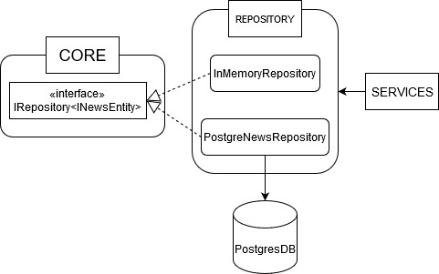

# CAMILLION CODE ASSIGMENT

In this repository you will find solution for the code assigment by [Camillion](https://www.camillion.app/). The assigment consist on coding a news API that will store and retrieve news articles focusing on quality and good practices, more details about the requirements on *Backend Code Test.pdf*.

All code is written with [typescript](https://www.typescriptlang.org/), the [nodejs](https://nodejs.org/es/) version used was 12.18.0 and [npm](https://www.npmjs.com/) version 6.14.4. Also I have tried to follow the SOLID principles and a some-like clean architecture.

The source code of the project can be found on the NewsBackend subfolder next to the test suits.

To download and run the code open a terminal window and execute the following commands:

    git clone https://github.com/carlCarlson6/CamillionCodeAssignment.git
    cd ./CamillionCodeAssigment/NewsBackend
    npm run build
    npm run start

If you just want to run the code on development mode open two terminal windows and in one of them run:

    npm run dev:build

this runs the typescript transpiler on watch mode, it will look for changes on the source folder and transpile each time, and on the other window run:

    npm run dev:start

this command runs nodemon against ./build/source/index.js and when changes ocurr it re-runs the script.

When you run the code on "production" or "development" mode it will interact with a PostgresDB so it is necessary to add a *dev.env* file on the root of the NewsBackend folder with the following environment variables:

    postgres_host = <database_server_host>
    postgres_database = <database_name>
    postgres_user = <user_name>
    postgres_port =  <host_port>
    postgres_password = <password>

For executing the test suit just run:

    npm run test

apart of running and showing the tests results it will generate a *coverage* folder with more in depth analysis of the tests. Although the test runs against the typescript files directly I recomend to run the build command before testing.

The versions of the libraries used below can be found on the *package.json* file.

## NEWS BACKEND

The news API exposes the endpoint */api/news* and allows the http methods *GET* and *POST* to respectively retrieve all the news and add a new one news.

For the POST method is needed to send the data as JSON on the body implementing the following interface:

    {
        "title":  string,
        "description":  string,
        "text":  string,
        "author":  string
    }

All fields are mandatory.

The backend core is composed by four main modules:

- Core
- Api
- Services
- Repository

That will be decribed in detail in the following section.

Below you can observe depency graph between the modules.

### CORE

On this module are coded the interfaces of the application that will define the functionality of the services and repositories (IRepository, IAddNewsService and GetAllNewsService interfaces ). The INewsEntity interface acts as a data transfer object to flow the data through the system.

The objective of this module is to act as some kind of domain layer and to achive decoupling of the code from the infrastructe.

### API

The API module defines an [express](https://expressjs.com/es/) app that acts as a presentation layer that will receive and return information to the client. This module is composed of four submodules, which I will describe next, plus the dependecy injector.

- Server: Its mission is to initialize, configure (adding the routes, middlewares and set the port where the app will run) and initialize the API.
- NewsRoutes: Defines the route */api/news* and the HTTP methods (GET and POST) allowed, also maps the HTTP methods to the NewsController methods that will be executed.
- NewsController: Here lays the methods that will be executed when the HTTP methods are called and executing the services to complete the use case. The class AddNewsRequest, from the messages folder, is used here as a request parser to ensure that all the fields are on the request.
- Middlewares: The functions that are executed before the HTTP methods. These are two, isAuthenticated and isAuthorized, the first one is applaid on both methods and the second only at the post method. Here will be the authentication and authorization logic, since no real authentication process is needed both functions just execute a console log. For simplicity both middlewares are functions but if for example the execution of service is needed we will have to extend the function to a class with a method like ExecuteMiddleware and inject the services through the constructor following the inversion of dependecy principle.

#### Dependency Injection

Here, at the *DependyIntjection.ts* file, the interfaces are binded to its implementations and registered in the inversion of control container.

The PostgreNewsRepository is injected into the AddNewsServices and GetAllNewsServices, then both of them are injected into the NewsController which will be initialized at the NewsRoutes class. With the decorators *injectable* on the top of the class and *inject* on the constructor parameters the library knows how to resolve and where to inject the dependencies.

For this task I have used the [inversifyJS](http://inversify.io/) library. This submodule could have been located outside the API but to have some resemblance with [APS.NET Core](https://dotnet.microsoft.com/learn/aspnet/what-is-aspnet-core) I wanted to keep it on here.

### SERVICES

On these module we find the implementations of the service interfaces, their mission is to execute the logic or use cases of the application.

- AddNewsService: completes and formats the data, to follow the INewsEntity interface, sended from the controller to be stored on the database by the repository.
- GetAllNewsService: uses the repository to retrieve all the news from the database.

Both services depends on the PostgreNewsRepository and are executed on the NewsController after parsing the request.

### REPOSITORY

Here we encounter the implementations of the IRepository interface that will execute the CRUD operations on the Postgres database (PostgreNewsRepository) or any other kind of persistence system (InMemoryNewsRepository).

These repositories are used by the services to complete their functionality (retrieve and add data).

The InMemoryNewRepository was only used during early development time, now does not accomplish any functionality.

On the PostgreRepository submodule we also find NewsEntityModel class that definds ORM model and the TypeOrmDbConnector, who follows a the singleton pattern, that executes the connection to de database.

The ORM engine used was [TypeOrm](https://typeorm.io/#/).

## TESTING

Next to the source code folder on NewsBackend we find the test folder containing the test suits, these are:

- AddNewsService.test.ts - unitary tests for the AddNewsService class.
- GetAllNewsService.test.ts - unitary tests for the GetAllNewsService class.
- NewsController.test.ts - test that the controller returns the correct status codes on the response, since the controllers response directly with the data returned from the services the response body data is not tested.

The PosgreNewsRepository only interacts with the TypeOrm code I decided not to write tests for this class since I will have to mock the library code.
For testing library I have used [jest](https://jestjs.io/) and [ts-jest](https://github.com/kulshekhar/ts-jest) to process the jest tests written with typescript.

On the mocks subfolder you can find the mocks for the services, repository and request and response objects for reutilization on the tests. For mocking I have used the [moq.ts](https://github.com/dvabuzyarov/moq.ts) library.

## CONTINUOS INTEGRATION

This projects uses continuos integration with github actions to automate the build and tests, on the .github/workflows folder you can find the main.yml file that will orchestate this jobs.

When a new pull request is created to the master branch the RUN - BUILD & TEST action will be executed (actions tab on github) installing the npm modules, creating the build and running the tests.
