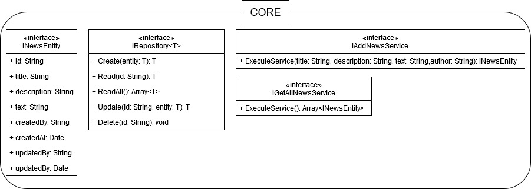

# CAMILLION CODE ASSIGMENT

In this repository you will find solution for the code assigment by [Camillion](https://www.camillion.app/). The assigment consist on coding a news API that will store and retrieve news articles focusing on quality and good practices, more details on *Backend Code Test.pdf*.

All code is written with [typescript](https://www.typescriptlang.org/) and I have tried to follow the SOLID principles and a some-like clean architecture.

The source code of the project can be found on the NewsBackend subfolder next to the test suits. 

To download and run the code open a terminal window and execute the following commands:

    git clone https://github.com/carlCarlson6/CamillionCodeAssignment.git
    cd ./CamillionCodeAssigment/NewsBackend
    npm run build
    npm run start

If you just want to run the code on development mode open two terminal windows and in one of them run:

    npm run dev:build
this runs the typescript transpiler on watch mode, it will look for changes on the source folder and transpile each time, and on the other window run:

    npm run dev:start
this command runs nodemon against ./build/source/index.js and when changes ocurr it re-runs the script.

When you run the code on "production" or "development" mode it will interact with a PostgresDB so it is necessary to add a *dev.env* file on the root of the NewsBackend folder with the following environment variables:

	postgres_host = <database_server_host>
	postgres_database = <database_name>
	postgres_user = <user_name>
	postgres_port =  <host_port>
	postgres_password = <password>

For executing the test suit just run:
	
	npm run test
apart of running and showing the tests results it will generate a *coverage* folder with more in depth analysis of the tests. Although the test runs against the typescript files directly I recomend to run the build command before the tests.

I have used the nodejs version 12.18.0 and npm version 6.14.4.

## NEWS BACKEND

The news API exposes one endpoint */api/news* and allows the http methods *GET* and *POST* to respectively retrieve all the news and add a new one news.

For the POST method is needed to send the data on the body implementing the next interface:

    	{
			"title":  string,
			"description":  string,
			"text":  string,
			"author":  string
		}
All fields are mandatory.

The backend core is composed by four main modules:
- Core
- Api
- Services
- Repository

That will be decribed in detail in the following section.

Below you can observe depency graph betweem the modules. 

### CORE

On this module are coded the interfaces of the application that will define the functionality of the services and repositories (IRepository, IAddNewsService and GetAllNewsService interfaces ). The INewsEntity interface acts as a data transfer object to flow the data through the system.

The objective of this module is to act as some kind of domain layer and to achive decoupling of the code from the infrastructe.

### API

### SERVICES

### REPOSITORY

We encounter the implementatios of the implementations of the IRepository interface that will execute the CRUD operations on the Postgres database (PostgreNewsRepository) or any other kind of persistence system (InMemoryNewsRepository).

The InMemoryNewRepository was only used during early development time, now does not accomplish any functionality.

On the PostgreRepository submodule we also find NewsEntityModel class that definds ORM model and the TypeOrmDbConnector who follows a the singleton pattern and executes the connection to de database.

The ORM engine used was [TypeOrm](https://typeorm.io/#/).

## TESTING

## CONTINUOS INTEGRATION

This projects uses continuos integration with github actions to automate the build and tests, on the .github/workflows folder you can find the main.yml file that will orchestate this jobs.

When a new pull request is created to the master branch the RUN - BUILD & TEST action will be executed (actions tab on github) installing the npm modules, creating the build and running the tests.
