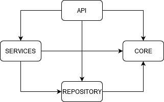

# CAMILLION CODE ASSIGMENT

In this repository you will find my code solution for the code assigment by [Camillion](https://www.camillion.app/). The assigment consist on coding a news API that will store and retrieve news articles focusing on quality and good practices, more detais on *Backend Code Test.pdf*.

The source code of the project can be found on the NewsBackend subfolder next to the test suits. 

To download and run the code open a terminal window and execute the following commands:

    git clone https://github.com/carlCarlson6/CamillionCodeAssignment.git
    cd ./CamillionCodeAssigment/NewsBackend
    npm run build
    npm run start

If you just want to run the code on development mode open two terminal windows and in one of them run:

    npm run dev:build
this runs the typescript transpiler on watch mode, it will look for changes on the source folder and transpile each time, and on the other window run:

    npm run dev:start
this command runs nodemon against ./build/source/index.js and when changes ocurr it re-runs the script.

When you run the code on "production" or "development" mode it will interact with a PostgresDB so it is necessary to add a *dev.env* file on the root of the NewsBackend folder with the following environment variables:

	postgres_host = <database_server_host>
	postgres_database = <database_name>
	postgres_user = <user_name>
	postgres_port =  <host_port>
	postgres_password = <password>

For executing the test suit just run:
	
	npm run test
apart of running and showing the tests results it will generate a *coverage* folder with more in depth analysis of the tests. Although the test runs against the typescript files directly I recomend to run the build command before the tests.

## NEWS BACKEND

The news API exposes one endpoint */api/news* and allows the http methods GET and POST to respectively retrieve all the news and add a new one news.

For the POST method is needed to send the following data on the body:

    	{
			"title":  "title of another other one article",
			"description":  "description of another other one article",
			"text":  "the text of another other one article",
			"author":  "carl"
		}

The backend core is formed by four main modules:
- Core
- Api
- Services
- Repository

Below you can observe depency graph betweem the modules. 

### CORE

### API

### SERVICES

### REPOSITORY

## TESTING

## CONTINUOS INTEGRATION
